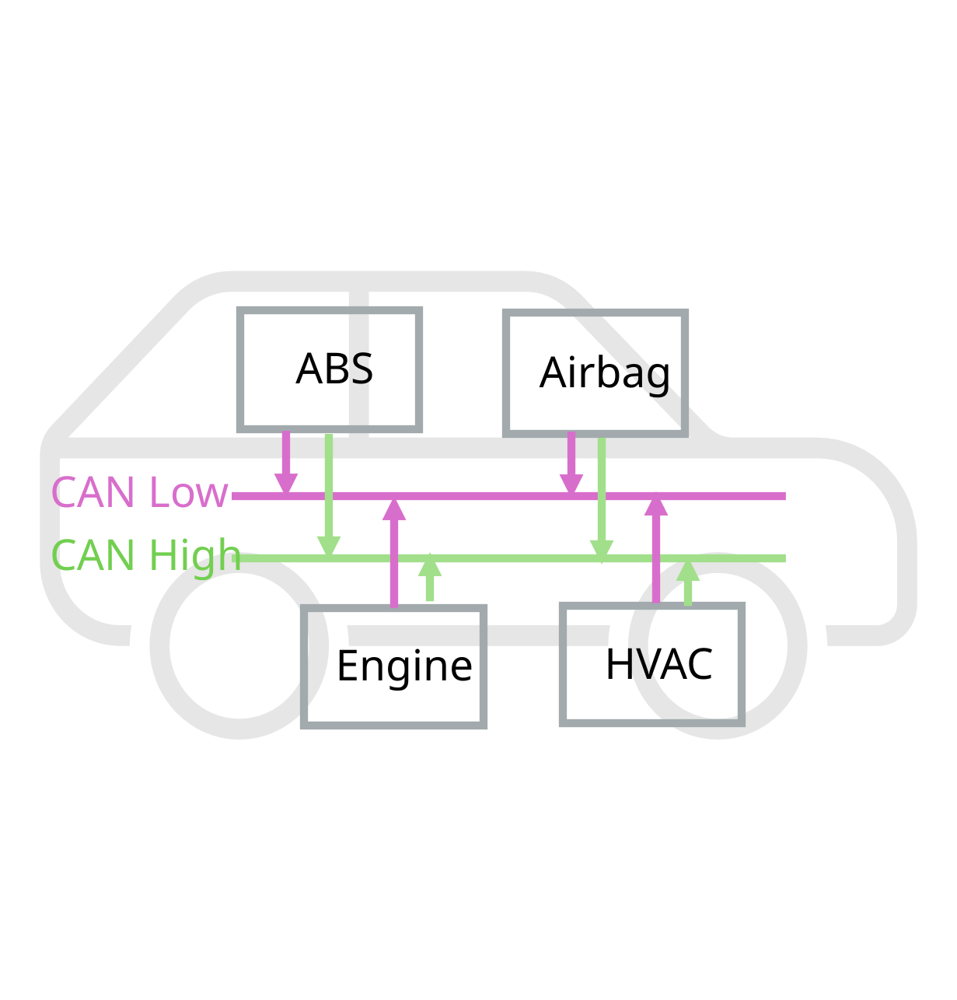
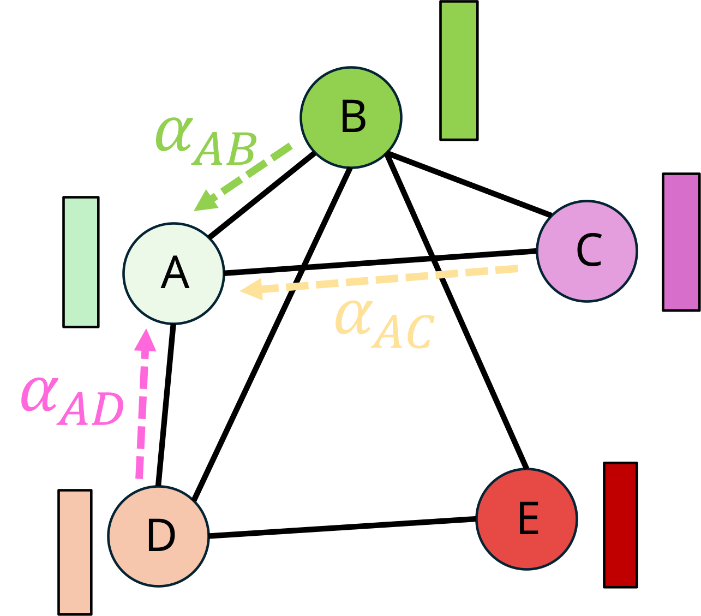
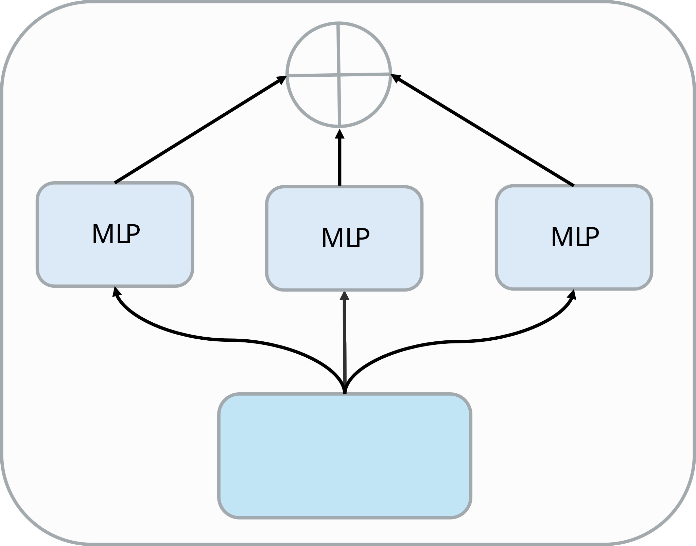

# KD-GAT

### Adaptive Fusion of Graph-Based Ensembles for Automotive Intrusion Detection

Robert Frenken · The Ohio State University · Candidacy · 2026

---

<!-- layout: section-break -->

## Problem Statement

---

<!-- columns: 3 -->

## Motivation

```box
title: Single Model Brittleness:
tone: accent
content: |
  - “specialist weakness” phenomenon: individual deep learning models achieve high accuracy on known attacks but are vulnerable to unseen attack types or attacks focusing on a structural weakness of a model’s architecture
```

|||

```box
title: Resource Contraints:
tone: accent
content: |
  - Models developed under academic research using GPU-scaling need to significantly downsize to meet the limited onboard resources of production vehicles
  - ARM Cortex processors require <<50--100ms latency
```

|||

```box
title: Model Opaqueness:
tone: accent
content: |
  -  Highly accurate models face systematic rejection in safety-critical systems because users cannot understand or verify decisions
```

---

<!-- img-fill -->

## CAN Bus Network



---

<!-- layout: section-break -->

## Current Framework

---

<!-- columns: 2 -->

## GAT Architecture



- Inspired by attention models, Graph Attention Transformer (GAT) adds a learnable attention variable $𝛼_𝑣𝑢$ to dynamically weight the importance of a node’s neighbors

$$
\alpha_{vu} = \mathrm{softmax}\left(
    \mathrm{LeakyReLU}\left(
        \mathbf{a}^\top
        \left[
            \mathbf{W}\mathbf{h}_v \| \mathbf{W}\mathbf{h}_u
        \right]
    \right)
\right)
$$

|||

```iframe
src: https://frenken-lab.github.io/kd-gat-paper/assets/html/submission/kd-gat.html
height: 480
title: KD-GAT architecture
```

---

## Architecture Detail

```iframe
src: https://frenken-lab.github.io/kd-gat-paper/assets/html/submission/architecture.html
height: 480
title: Full architecture diagram
```

---

<!-- rows: 1/2 -->

## Fusion: MoE



===

<!-- row-columns: 1/1/1 -->

**MLP Layers**

```python
layers: list[nn.Module] = []
cur = in_dim
for h in hidden:
    layers.extend([nn.Linear(cur, h), nn.ReLU(), nn.Dropout(0.2)])
    cur = h
layers.append(nn.Linear(cur, out_dim))
return nn.Sequential(*layers)
```

|||

**Load Balancing**

```python
P = self._last_gate_weights.mean(dim=0)
K = P.numel()
return K * (P * P).sum()
```

- $\alpha = 0.01$

|||

**Loss Function**

```python
entropy = -(w * w.clamp_min(1e-9).log()).sum(-1).mean()
```

- 0 = collapsed to one expert, $\log K$ = uniform routing

---

## Ablation Results

<!-- TODO: Pull results from graphids empirical docs (quick) later do "pure" pull from hugging face -->

- content table here

---

## Main Results

<!-- TODO:  -->

- content table here

---

## Dimensionality (UMAP) Analysis

```iframe
src: https://frenken-lab.github.io/kd-gat-paper/assets/html/submission/umap.html
height: 520
title: UMAP embedding analysis
```

---

## Key Result: Representational Alignment (CKA)

<!-- TODO: what CKA shows — the student has learned the teacher's internal representation despite the compression. This is the empirical core of the completed work. -->

```iframe
src: https://frenken-lab.github.io/kd-gat-paper/assets/html/submission/cka.html
height: 480
title: CKA representational similarity
```

---

<!-- layout: section-break -->

## Proposed Research

---

## Proposed Work: Composition Pipeline

<!-- TODO: four research axes — bandit fusion, curriculum scheduling, federated calibration, explainability. One sentence each. -->

```iframe
src: https://frenken-lab.github.io/kd-gat-paper/assets/html/submission/composition-pipeline.html
height: 480
title: Proposed composition pipeline
```

---

## Q1: Physics & Dynamic Controls

```iframe
src: https://frenken-lab.github.io/kd-gat-paper/assets/html/submission/vehicle-pinn.html
height: 480
title: Vehicle CAN to PINN pipeline
```

---

## Q2: Model Interpretability & Calibration

```iframe
src: https://frenken-lab.github.io/kd-gat-paper/assets/html/submission/attention.html
height: 480
title: Attention weight visualization
```

---

## Q3: Federated Learning & Convergence

```iframe
src: https://frenken-lab.github.io/kd-gat-paper/assets/html/submission/fedavg-drift.html
height: 480
title: FedAvg calibration drift
```

---

## Q4: Reinforcement Learning

```iframe
src: https://frenken-lab.github.io/kd-gat-paper/assets/html/submission/fusion.html
height: 480
title: Expert fusion mechanism
```

---

## Thesis Argument Structure (GSN)

<!-- TODO: walk through what's done vs what's open. The hollow diamonds are the punch list:
G1 = coverage void on CAN data (asserted, needs derivation), G3 = Mondrian abstain rate under
K7 imbalance (asserted, needs empirical bound or mechanism swap), and two composition theorems
(S-thesis: coverage + compression; S-N02-instance: Mondrian + safety shield + joint apparatus).
This slide is the segue into Timeline — the diamonds are the work the dissertation closes. -->

```iframe
src: https://frenken-lab.github.io/kd-gat-paper/assets/html/submission/gsn-thesis.html
height: 600
title: kd-gat thesis argument — GSN safety case
```

